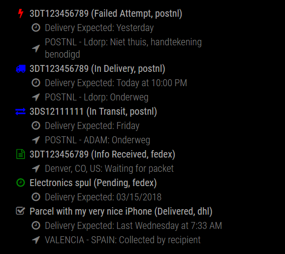
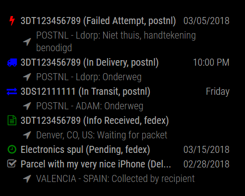
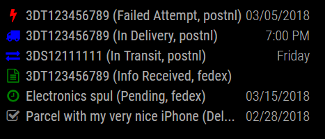
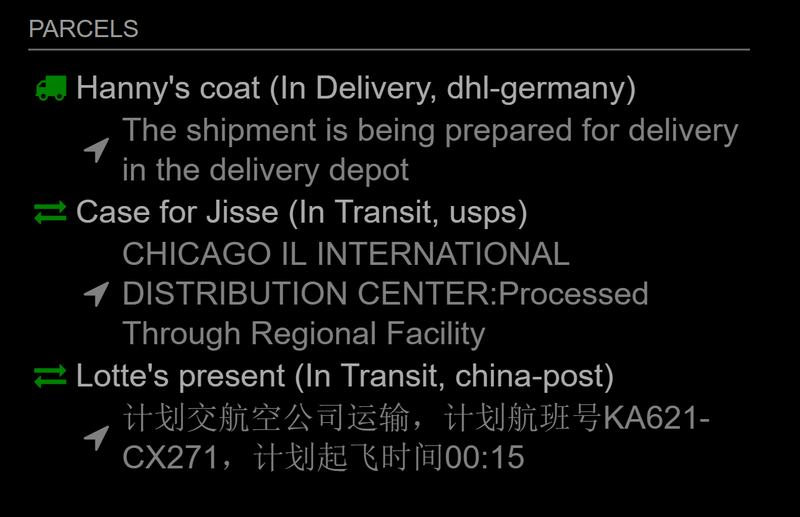
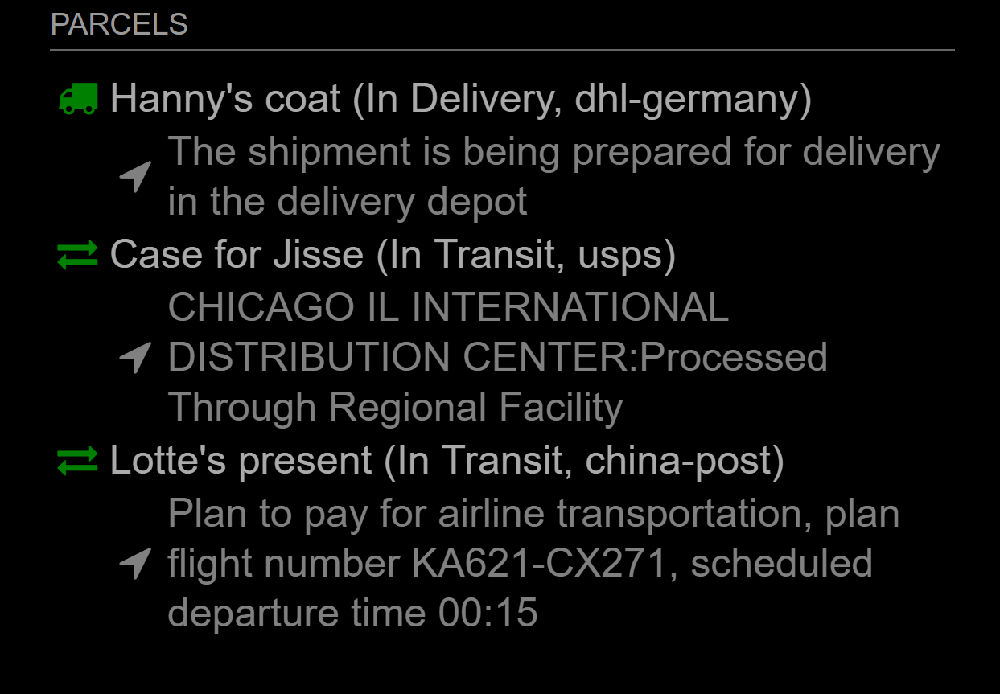
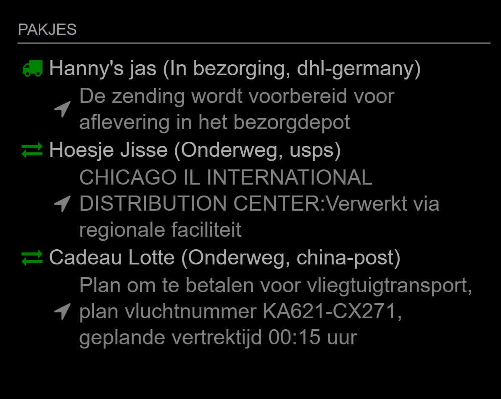

## MMM-Parcel

Track deliveries . Supports 428 couriers worldwide based on aftership.com

## Here's what you get

View parcel tracking status, for display on Magic Mirror.
Inspired by MMM-AfterShip by Mykle1.

## Examples

Example with expected deliveries on a separate line. Expected delivery line is only shown when an ETA is known. 



Example of the same in the compact view:



And in the very compact view (one-liner per shipment):



## Installation

* Go into the `~/MagicMirror/modules` directory and do `git clone https://github.com/martinkooij/MMM-Parcel`.

* Go into the MMM-Parcel directory and do `npm install`

* Get an account on aftership.com (Free account is OK if you track less than 100 parcels per month)

* Get your FREE API Key from https://www.aftership.com/ via settings -> API. 

* You MUST add couriers to your account at aftership.com. 

* Add your own trackings

* Tell me what you like, or any issues you have. It is difficult to test as I cannot control or test all variations from AfterShip. 

## Using the module

To use this module, add it to the modules array in the `config/config.js` file:
````javascript
{
module: 'MMM-Parcel',
position: 'top_right',	// This can be any of the regions. Best results in left or right regions.
header: 'My Parcels',   // This is optional
config: {
	apiKey: 'Your API KEY goes here', // Your free API Key from aftership.com
	maxNumber: 10, //maximum number of Parcels to show
	showCourier: true,
	autoHide: false, // hide module on mirror when there are no deliveries to be shown
	isSorted: true,  // sort on delivery Status (most important ones first)
	compactness: -1, // 0 = elaborate, 1 = compact display, 2 = very compact, one-liner per shipment, -1 = automatic
	hideExpired: true, // don't show expired parcels
	hideDelivered: false, // determines whether to show delivered parcels. Not recommended to hide. 
	updateInterval: 600000, // 10 minutes = 10 * 60 * 1000 milliseconds. 
	parcelStatusText: ["Exception", "Failed Attempt","In Delivery", "In Transit", 
	                   "Info Received", "Pending", "Delivered", "Expired"], // This is the default. Enter your own language text
	parcelIconColor: ["red", "red", "green", "green", "cornflowerblue", "cornflowerblue", "grey", "grey"], // This is the default. Change for other icon colors
	onlyDaysFormat: {
	  lastDay : '[Yesterday]',
	  sameDay : '[Today]',
	  nextDay : '[Tomorrow]',
	  lastWeek : '[Last] dddd',
	  nextWeek : 'dddd',
	  sameElse : 'L'
	  }, // formatting when only days are shown and time is unknown. 
	expectedDeliveryText: 'Delivery Expected: '	 // This is the default. Changes time infoline. 
	}
},
````

The above example is a bit long. If you are OK with English texts and you do like the default colors and settings 
provided by the module the following simple config suffices!

````javascript
{
module: 'MMM-Parcel',
position: 'top_right',	// This can be any of the regions. Best results in left or right regions.
header: 'My Parcels',   // This is optional
config: {
	apiKey: 'Your API KEY goes here' // Your free API Key from aftership.com
	}
},
````

## Configuration options

The following properties can be configured:


<table width="100%">
	<!-- why, markdown... -->
	<thead>
		<tr>
			<th>Option</th>
			<th width="100%">Description</th>
		</tr>
	<thead>
	<tbody>
		<tr>
			<td><code>apiKey</code></td>
			<td>REQUIRED: Your AfterShip API access token, you can get it via <a href="https://aftership.com">aftership.com</a>. This is the only required config field<br>
				<br><b>Possible values:</b> <code>string</code>
				<br><b>Default value:</b> <code>none</code>
			</td>
		</tr>
		<tr>
			<td><code>maxNumber</code></td>
			<td>Maximum number of parcels that are shown<br>
				<br><b>Possible values:</b> <code>int</code>
				<br><b>Default value:</b> <code>10</code>
			</td>
		</tr>
		</tr>
		<tr>
			<td><code>showCourier</code></td>
			<td> Determines whether  the shortcode of the courier in the Parcel header is shown<br>
				<br><b>Possible values:</b> <code>true</code>, <code>false</code>
				<br><b>Default value:</b> <code>true</code>
				<br><b>Example:</b> "3DT123456789(In transit, fedex)" is shown when <code>showCourier: true</code> 
				and "3DT123456789(In transit)" is shown when <code>showCourier: false</code>
			</td>
		</tr>
		<tr>
			<td><code>autoHide</code></td>
			<td>The module hides itself when there are no parcels found<br>
				<br><b>Possible values:</b> <code>true</code>, <code>false</code> 
				<br><b>Default value:</b> <code>false</code>
				<br><b>Note:</b> Hide module from the mirror when there are no Parcels to be shown. Also reduces the update interval 
				to minimally every 15 minutes or else 2 times the configured <code>updateInterval</code> whichever one is the longest.  
			</td>
		</tr>
		<tr>
			<td><code>isSorted</code></td>
			<td>Parcels are shown in a sorted order depending on status. The module implements a fixed --non-configurable-- sort order 
			    for the parcel statuses from the API. The order is:	<code>Exception</code>, <code>AttemptFail</code>,
			    <code>OutForDelivery</code>, <code>InTransit</code>, <code>InfoReceived</code>, 
				<code>Pending</code>, <code>Delivered</code>, <code>Expired</code><br>
				<br><b>Possible values:</b> <code>true</code>, <code>false</code> 
				<br><b>Default value:</b> <code>true</code>
				<br><b>Note:</b> Exceptions first, Expired last. Sort is according to urgency of action needed from the receiver. 
			</td>
		</tr>
		<tr>
			<td><code>compactness</code></td>
			<td>Determines whether the expected delivery time (if known for the parcel) is shown on a separate line or on the same line 
			     as the parcel header (see pictures for example). <br>
				<br><b>Possible values:</b> <code>-1</code>, <code>0</code>, <code>1</code> or <code>2</code>
				<br><b>Default value:</b> <code>-1</code>
				<br><b>Note:</b> <code>0</code> displays the shipment with expected delivery time (if present) on a separate line.
				it also displays a separate info line on the latest checkpoint (if present).
				<code>1</code> shows a more compact version and <code>2</code> effectively makes it a one-liner per shipment. 
				<code>-1</code> (=automatic) takes a compactness depending on the #parcels shown 
				   (<code>0</code> when <=3, <code>1</code> when <=6, <code>2</code> in case of long lists). 
			</td>
		</tr>
		<tr>
			<td><code>hideExpired</code></td>
			<td>Determines whether parcels with status "Expired" should be shown.<br>
				<br><b>Possible values:</b> <code>true</code>, <code>false</code> 
				<br><b>Default value:</b> <code>true</code>.
			</td>
		</tr>
		<tr>
			<td><code>hideDelivered</code></td>
			<td>Determines whether parcels with status "Delivered" should be shown.<br>
				<br><b>Possible values:</b> <code>true</code>, <code>false</code> 
				<br><b>Default value:</b> <code>false</code>
				<br><b>Note:</b> <em>Not recommended for use</em>. Sometimes the infoline shows important info where, when and how the delivery was. 
				You don't want to forget your parcel if it has been delivered at the neighbors ;). 
			</td>
		</tr>
		<tr>
			<td><code>updateInterval</code></td>
			<td>Time between requests to the API in milliseconds<br>
				<br><b>Possible values:</b> <code>int</code>
				<br><b>Default value:</b> <code>600000</code> =10 minutes.
				<br><b>Note:</b> Internally the module sets 60000 (1 minute) as an absolute lower bound, whatever the config value is. Don't overload the API!
			</td>
		</tr>	
		<tr>
			<td><code>parcelStatusText</code></td>
			<td>Text to show for the statuses of the Parcel<br>
				<br><b>Possible values:</b> <code>[s1,...,s8]</code>. Array of 8 strings defining the names for the statuses in the order mentioned in the
				       <code>isSorted</code> option above. 
				<br><b>Default value:</b> <code>["Exception",...,"Expired"]</code>. English is default. Choose your own language descriptions.
				<br><b>Example:</b> <code> parcelStatusText: ["Fout", "Mislukte bezorging","In bezorging", "Onderweg",
                				"Ingevoerd", "Wachtend", "Afgeleverd", "Te oud"],</code> for Dutch Status texts. If you trust the colored status icons to guide you, 
								you can leave all 
								(or some) of these texts empty by defining empty strings (<code>""</code>). Just take care to specify an array of total 8 strings! 
								Default are English texts, if you are happy with the English descriptions you may leave this item out of your module-config.  
			</td>
		</tr>			
		<tr>
			<td><code>parcelIconColor</code></td>
			<td>Colors of the parcel status icons in the header<br>
				<br><b>Possible values:</b> <code>[s1,...,s8]</code>. Array of 8 strings defining the icon colors. 
				<br><b>Default value:</b> <code>["red","red","green","green","cornflowerblue","cornflowerblue","grey","grey"]</code>. 8 colors.
				<br><b>Note:</b> The colors are icon colors of the Parcel Status in the same order as the texts in the <code>isSorted</code> option above.
				When you are comfortable with the above mentioned colors you do not need to specify this item in the module-config. 
				<br><b>Note:</b> If the extra info line (whether visible or not) contains the text "to be collected" the parcel is marked as delivered but should still be collected. 
				To make that visible the icon color of the delivered icon changes in that case
				to the color of <code>OutforDelivery</code> status. Default: from </code>"grey"</code> to <code>"cornflowerblue"</code>. 
			</td>
		</tr>	
		<tr>
			<td><code>onlyDaysFormat</code></td>
			<td>Format for delivery time when no hour is yet known for the Parcel. In moment.js calendar format<br>
				<br><b>Possible values:</b> <code>moment.js calendar locale specification</code>
				<br><b>Default value:</b> 
				<br><code>{lastDay : '[Yesterday]',</code>
				<br> <code>sameDay : '[Today]',</code>
				<br> <code>nextDay : '[Tomorrow]',</code>
				<br> <code>lastWeek : '[Last] dddd',</code>
				<br> <code>nextWeek : 'dddd',</code>
				<br> <code>sameElse : 'L'}</code>
				<br><b>Example:</b> Fill in your language preference. English is default. Only relevant when <code>compactness: 0</code>. 
				 This option does nothing otherwise. 
			</td>
		</tr>
		<tr>
			<td><code>expectedDeliveryText</code></td>
			<td>Text to show before showing the expected delivery date<br>
				<br><b>Possible values:</b> <code>string</code>
				<br><b>Default value:</b> <code>"Delivery expected: "</code>
				<br><b>Example:</b> Use "Bezorging verwacht:" in Dutch for example. Only relevant when <code>compactness: 0</code>. 
				 This option does nothing otherwise. 
			</td>
		</tr>
		<tr> 
		    <td><code>autoTranslate</code></td>
			<td>Translate text shown on the infoline into your own language of choice via Google Translate<br>
				<br><b>Possible values:</b> <code>language string</code>. 
				<br><b>Default value:</b> <code>false</code>
				<br><b>Example:</b> See description below for use. The Google API is not called/used if <code>false</code>. 
			</td>
		</tr>
	</tbody>
</table>

## Auto Translation
Many couriers enter checkpoint message in the language of the country of origin, sometimes aftership decides to translate to english, sometime not.
the MMM-Parcel module contains a translation feature of these information texts based on Google Translate API. 

<em>Note:</em> Using the Google Translation API is not completely free, so it is a little more difficult install. Leaving <code>autoTranslate</code> out 
from the config file
(or set <code>autoTranslate: false</code>, which amounts to the same) and the module will just show the original messages and the API will
 not be used at all by the module. So no worries. You can just skip this section if you are not interested and all will be free and easy. 
 
An example of a non-translated view on the mirror: 
 


The infotexts can be automatically translated via Google translate API. For this you need a valid <code>.json</code> keyfile from Google that contains your identity 
and your Google cloud project. Also the project should be coupled to a Cloud billing account before you can use the API, because the use of Google Translate API
is not free(!). Google Cloud services provide a free first year subsciption, so you can try! 

Carefully follow the next steps. The goal is to retrieve from google a valid .json file that you can use! 
<ul> 
<li>Create or select a your own Google Project Cloud project via https://console.cloud.google.com/ </li>
<li>Create a service account for this project <code>.json</code> file, see https://console.cloud.google.com/apis/credentials/serviceaccountkey. 
Mind that you are in the right project! Choose create a new service account at dropdown, then choose any nice descriptive name and select Role -> Project -> Owner. 
Now the infamous keyfile is created. Store carefully, you will need (a copy of) this keyfile later</li>
<li>Create a billing account for Google Cloud Services (https://console.cloud.google.com/billing).</li>
<li>Open the API dashboard of your project (https://console.cloud.google.com/apis/). Go to the console left side menu and select Billing. Link your Billing account.</li>
<li>Open the API dashboard of your project. Click on Enable API's and choose Translation</li>
</ul>
This ends the preparation of the authentication and authorization of the translate API at the google side of things. Congrats! Now we need to tell the Mirror...
 Luckily this is the easier part. 
 <ul>
 <li> go to the <code>~/MagicMirror/modules/MMM-Parcel</code> directory on your mirror</li>
 <li> transfer the .json file to this directory. (https://www.makeuseof.com/tag/copy-data-raspberry-pi-pc/)</li>
 <li> rename the file to <code>parceltranslate-credentials.json</code>. Mind you: exactly this name!</li>
 <li> check whether this file now exists in your <code>MMM-Parcel</code> directory together with the other files such as <code>MMM-Parcel.js, node_helper.js</code>, etc.</li>
 </ul>
 Now you are set(!) and add for example <code>autoTranslate : "en",</code> in the <code>config.js</code> file in the MMM-Parcel descriptions. 
 Restart the mirror and off you go! Please know that the miror always saves the last translation done, so if there is no change in deliveries 
the google API will not be called again. 
 
 
 
For me I adapted my mirror to Dutch by setting Dutch language settings and autoTranslate to <code>"nl"</code> in the config:
````javascript
{
module: 'MMM-Parcel',
position: 'top_right',
header: 'Pakjes',   
config: {
	apiKey: 'XXXXXXXXXXXXXX', // API key of Aftership
	compactness: -1,
	autoTranslate: "nl",
	parcelStatusText: ["Fout", "Mislukte bezorging","In bezorging","Onderweg", "Ingevoerd", "Wachtend", "Afgeleverd", "Te oud"],
	onlyDaysFormat: 
		{lastDay : '[gisteren]',
		 sameDay : '[vandaag]',
		 nextDay : '[morgen]',
		 lastWeek : '[afgelopen] dddd',
		 nextWeek : 'dddd',
		 sameElse : 'L'},
	expectedDeliveryText: 'Bezorging verwacht: '
	}
},
````

And Yo, see the Dutch mirror:




## Dependencies
- [aftership] (installed via `npm install`)
- [@google-cloud/translate] (installed via `npm install`)
- [moment] (already available)
- font-awesome 4.7.0 (already available)

## Newest features
- autoHide implemented
- compactness option of -1 added for auto-adjusting display depending on number of parcels shown. 
- possibility to translate the info texts. 

## Known issues
- Aftership does a good job in collecting  information from the courier but is not perfect. Use the mirror presentation as a hint.

